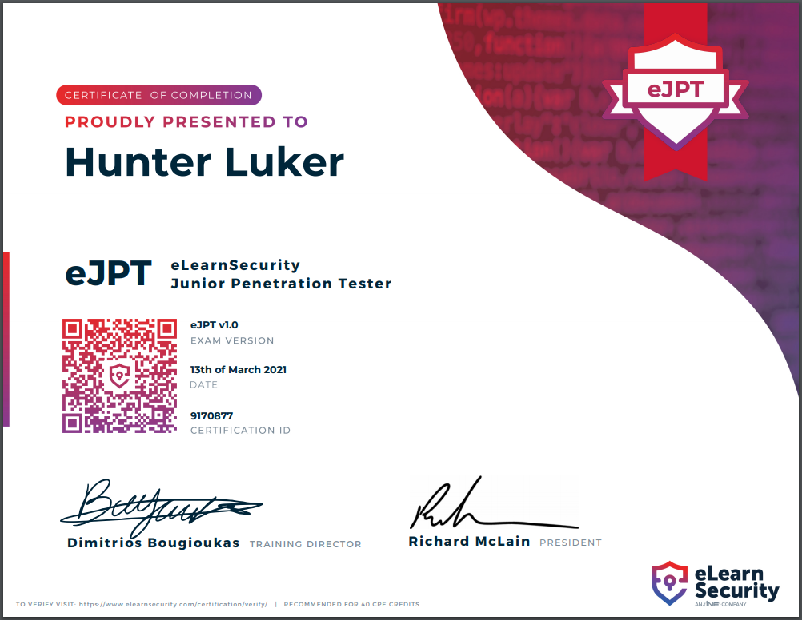

# eJPT Notes

## Intro
These are a collection of my notes for the eLearnSecurity Junior Penetration Tester Certification. Hopefully, they will be as helpful to others as they were for me. After passing the eJPT, I can definitely recommend this cert to anyone who is interested in security/pentesting.

---
## Table of Contents

- [Networking](/pages/networking.md)
- [Penetration Testing](/pages/pentesting.md)
- [Information Gathering](/pages/info_gathering.md)
- [Footprinting & Scanning](/pages/footprinting_scanning.md)
- [Vulnerability Assesment](/pages/vuln_assesment.md)
- [Web Attacks](/pages/web_attacks.md)
- [System Attacks](/pages/system_attacks.md)
- [Network Attacks](/pages/network_attacks.md)
- [Pivoting](/pages/pivoting.md)

---
