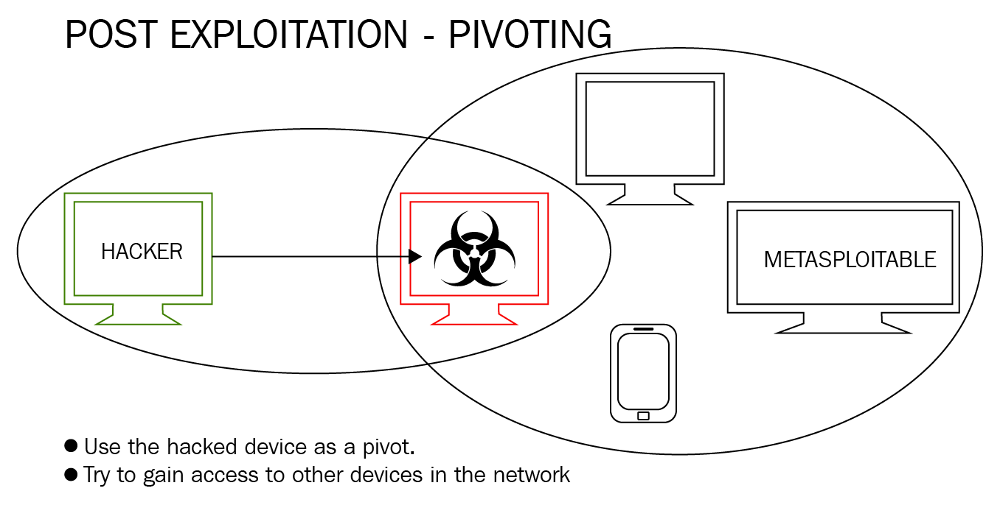

# Pivoting

Pivoting is the exclusive method of using an instance also known by ‘foothold’ to be able to “move” from place to place inside the compromised network. It uses the first compromised system foothold to allow us to compromise other devices and servers that are otherwise inaccessible directly.



Example: Lets say an attacker has the IP address of 192.168.56.101. The attacker then compromises another computer with the address of 192.168.56.202, but this computer also has access to another IP range of 10.10.10.0/24. Now the attacker can use the compromised machine to "pivot" or gain access to the second network they initally did not have access to.

### Metasploit Pivoting

We have compromised a machine and now have a meterpreter shell on it. Running the ifconfig command reveals another IP addres off 10.10.1.101. Metasploit has a built in AutoRoute script that we can use to attack the second network through the first compromised machine.

```
# Background the initial session
background

# Adding the new route towards the new network range
run autoroute -s 10.10.1.0/24

# Using the tcp scan auxiliary module we can now scan the new target found
use auxiliary/scanner/portscan/tcp
set PORTS <list of common ports>
set RHOSTS 10.10.1.101
run
```
